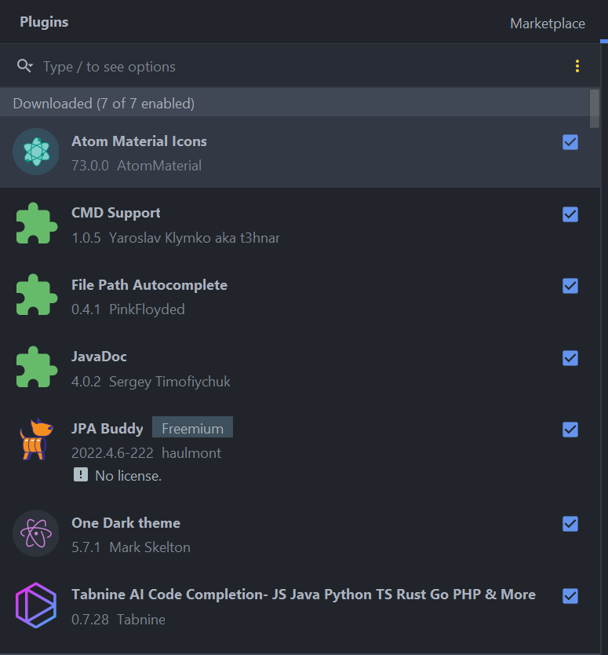
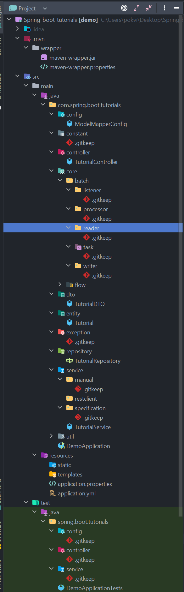
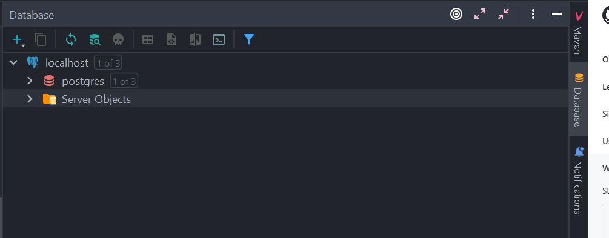
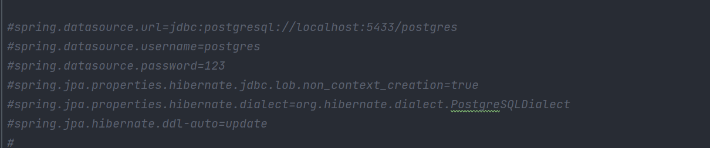
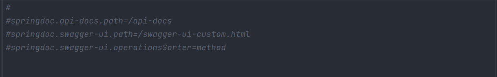
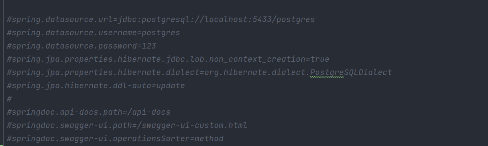

# Spring-boot-tutorials
This repository for exploring spring boot purpose.

Following are step to setup project with spring-boot-tutorial:

### Requirements:    
1. Jave JDK version 11
2. Node version v14.17.3 or latest one
3. Npm version 6.14.13 or latest one
4. Git

### Step by step set up environments:
1. initialize the project from https://start.spring.io/ or clone from this repository.
2. Install Intellij for coding environments
3. Install SourceTree for Source code management (GUI)
4. Install PostgreSQL for database within 2 options: using docker image or installing


### Add plugins into intellij as belows:

**File menu => Settings => Plugins:**



### Using intillij-java-google-style instead of using with plugin:
 - Following this [intillij-java-google-style](https://github.com/HPI-Information-Systems/Metanome/wiki/Installing-the-google-styleguide-settings-in-intellij-and-eclipse) to setup code format.
 - Apply setup applying `Ctrl+Alt+L` to take effect on any java file.

### Following convention for folder and package structure:
**Note**: ask team leader for more details.

  

### In the following will apply knowledge base of spring boot.
**Notes**: Follow below step to work first. Before move on to another step.
1. Working with JPA, PostgreSQL:
   - Make sure the following property locate in `<dependencies>` block of pom.xml
      ```
         <dependency>
             <groupId>org.springframework.boot</groupId>
             <artifactId>spring-boot-starter-web</artifactId>
         </dependency>
         <dependency>
             <groupId>org.springframework.boot</groupId>
             <artifactId>spring-boot-devtools</artifactId>
             <scope>runtime</scope>
             <optional>true</optional>
         </dependency>
         <dependency>
             <groupId>org.projectlombok</groupId>
             <artifactId>lombok</artifactId>
             <optional>true</optional>
         </dependency>
         <dependency>
             <groupId>org.springframework.boot</groupId>
             <artifactId>spring-boot-starter-test</artifactId>
             <scope>test</scope>
         </dependency>
         <dependency>
             <groupId>org.springframework.boot</groupId>
             <artifactId>spring-boot-starter-data-jpa</artifactId>
         </dependency>
         <dependency>
             <groupId>org.postgresql</groupId>
             <artifactId>postgresql</artifactId>
             <scope>runtime</scope>
         </dependency>
      ```
   - Add this property to `<properties>` block to skip test in Maven lifecycle:
     ```
        <maven.test.skip>true</maven.test.skip>
     ```
   - Make sure JPA and PostgreSQL option properties available in application.properties.
     - **Note**:
         - Configure PostgreSQL driver for intellij using URL option to work first.
           
           
       
         - Add below option properties of PostgreSQL should be connected to PostgreSQL driver.
       
           
        
2. Working with Swagger(OpenAPI):
   - Make sure the following property locate in `<dependencies>` block of pom.xml
      ```
          <dependency>
              <groupId>org.springdoc</groupId>
              <artifactId>springdoc-openapi-ui</artifactId>
              <version>1.6.12</version>
              <exclusions>
                  <exclusion>
                      <groupId>org.yaml</groupId>
                      <artifactId>snakeyaml</artifactId>
                  </exclusion>
              </exclusions>
          </dependency>
          <dependency>
              <groupId>org.yaml</groupId>
              <artifactId>snakeyaml</artifactId>
              <version>1.33</version>
          </dependency>
      ```
   - Make sure Swagger option properties available in application.properties.
     
3. Working with DTO, Entity and ModelMapper:
   - Make sure the following property locate in `<dependencies>` block of pom.xml
      ```
          <dependency>
             <groupId>org.modelmapper</groupId>
             <artifactId>modelmapper</artifactId>
             <version>3.1.0</version>
          </dependency>
      ```
4. Working with yml file structure concept:
   - Apply below application.properties to application.yml instead.
   
5. Working with JPA specification:
   - Make sure the following properties locate in `<dependency>` block of pom.xml
   ```
        <dependency>
			<groupId>org.hibernate</groupId>
			<artifactId>hibernate-jpamodelgen</artifactId>
			<scope>provided</scope>
		</dependency>
   ```
6. Working with Spring security using jwt token:
   - Make sure the following properties locate in `<dependency>` block of pom.xml
   ```
        <dependency>
			<groupId>org.springframework.boot</groupId>
			<artifactId>spring-boot-starter-security</artifactId>
		</dependency>
		<dependency>
			<groupId>io.jsonwebtoken</groupId>
			<artifactId>jjwt-api</artifactId>
			<version>0.11.5</version>
		</dependency>
		<dependency>
			<groupId>io.jsonwebtoken</groupId>
			<artifactId>jjwt-impl</artifactId>
			<version>0.11.5</version>
			<scope>runtime</scope>
		</dependency>
		<dependency>
			<groupId>io.jsonwebtoken</groupId>
			<artifactId>jjwt-jackson</artifactId>
			<version>0.11.5</version>
			<scope>runtime</scope>
		</dependency>
   ```
7. Integrate project with SonarQube:
   1. Add these dependencies to your project pom.xml
      ```
        <plugin>
           <goupId>org.sonarsource.scanner.maven</groupId>
           <atifactId>sonar-maven-plugin</artifactId>
           <version>3.6.0.1398</version>
        </plugin>
      ```
   2. After finish each feature, run below command to analyze projcet:
       - mvn clean install
       - mvn sonar:sonar -Dsonar.host.url=http://10.2.50.83:9000 -Dsonar.projectkey=training_library_mngt -Dsonar.login=3e632fa36dad6edbffd8b0a1d9765d6439da49cc
   3. View result and fix code by go to
      >    http://10.2.50.83:9000
   
      >    go to you project with user: admin, pwd: 123